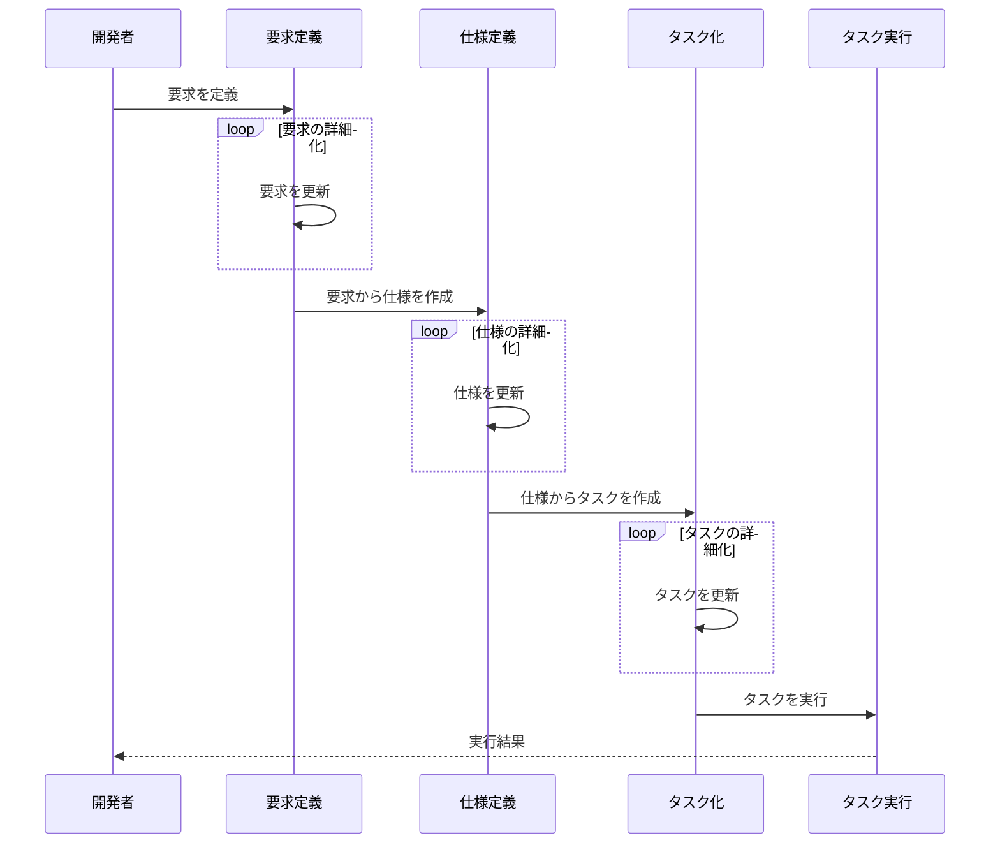

# 仕様駆動開発テンプレート

> [!CAUTION]
> このリポジトリは作成中です

## リポジトリ構成

```
.
├── commands
│   ├── requirements
│   │   ├── create.md
│   │   └── update.md
│   ├── spec
│   │   ├── create.md
│   │   └── update.md
│   └── task
│       ├── create.md
│       ├── execute.md
│       └── update.md
├── example
│   └── work
│       ├── common
│       │   ├── constraints.md
│       │   ├── project-structure.md
│       │   ├── techstack.md
│       │   └── testing.md
│       ├── phase-00001
│       │   ├── kanban.md
│       │   ├── requirements.md
│       │   ├── spec.md
│       │   └── tasks
│       │       ├── 001-feature-name
│       │       │   └── task.md
│       │       └── 002-feature-name
│       │           └── task.md
│       └── phase-00002
│           ├── kanban.md
│           ├── requirements.md
│           ├── spec.md
│           └── tasks
│               ├── 001-feature-name
│               │   └── task.md
│               └── 002-feature-name
│                   └── task.md
├── README.md
├── scripts
│   └── init.sh
├── template
│   ├── kanban.md
│   ├── requirements.md
│   ├── spec.md
│   └── task.md
└── work
    └── common
        ├── constraints.md
        ├── policy.md
        ├── project-structure.md
        ├── techstack.md
        └── testing.md
```

## 使用方法

### 初回セットアップ

```bash
npx git+https://github.com/soukadao/sdd-template.git
```

### 要求仕様書を作成する

Claude Code を使用する場合

```
> /requirements:create 足し算ができるようにしたい
```

## 開発フロー案



## 仕様駆動開発の構成案

```
work
├── common
│   ├── constraints.md
│   ├── techstack.md
│   └── testing.md
├── phase-1
│   ├── kanban.md
│   ├── requirements.md
│   ├── spec.md
│   └── tasks
│       ├── 001-feature-name
│       │   └── task.md
│       └── 002-feature-name
│           └── task.md
└── phase-2
    ├── kanban.md
    ├── requirements.md
    ├── spec.md
    └── tasks
        ├── 001-feature-name
        │   └── task.md
        └── 002-feature-name
            └── task.md
```

## 持ち越しの考え方

TODO:

次のフェーズを作成するタイミングで`Backlog`のタスクがあれば持ち越しとみなす？
要求の変更や仕様の変更にどう対応するか？

