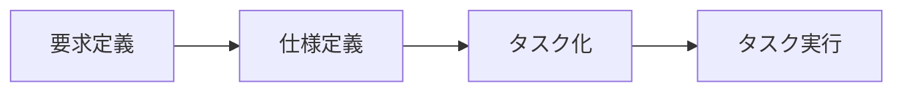

# 仕様駆動開発テンプレート

> [!CAUTION]
> このリポジトリは作成中です

## リポジトリ構成

- commands: コマンド
- template: テンプレート
- example: 仕様駆動開発例

## 開発フロー案



## 仕様駆動開発の構成案

```
work
├── phase-1
│   ├── kanban.md
│   ├── requirements.md
│   ├── spec.md
│   └── tasks
│       ├── 001-feature-name
│       │   └── task.md
│       └── 002-feature-name
│           └── task.md
└── phase-2
    ├── kanban.md
    ├── requirements.md
    ├── spec.md
    └── tasks
        ├── 001-feature-name
        │   └── task.md
        └── 002-feature-name
            └── task.md
```